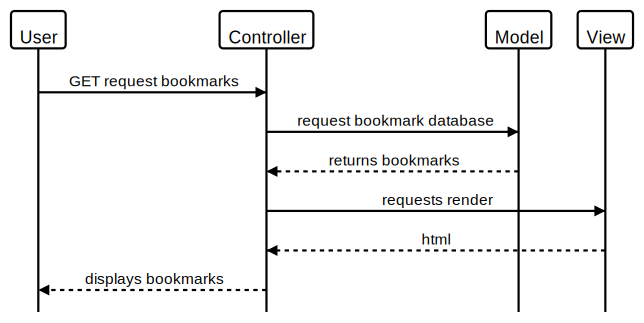

### To set up the database

Connect to `psql` and create the `bookmark_manager` database:

```
CREATE DATABASE bookmark_manager;
```

To set up the appropriate tables, connect to the database in `psql` and run the SQL scripts in the `db/migrations` folder in the given order.


User Story
==========

As a user
So that I can revisit my favoutite pages
I want to see a list of my bookmarks

Domain Model
------------


